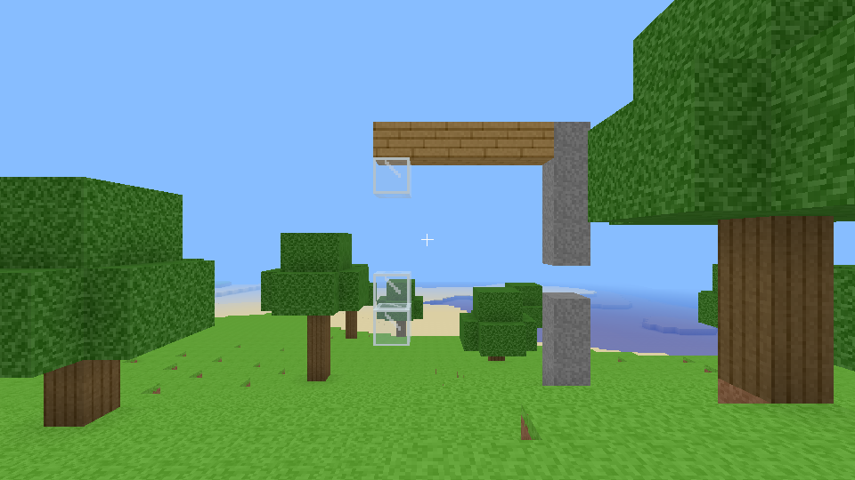

# blockclonia

A Minecraft-style voxel sandbox written from scratch in C11 and Vulkan 1.0,
with physics that tries to behave like the real world and a renderer tuned
for low-end hardware. All memory comes from [mimalloc](https://github.com/microsoft/mimalloc).



## What's in it

- **Infinite terrain** streamed around the player in 16×128×16 columns:
  continents, hills, ridged mountains with snow, beaches, oceans and trees.
- **Realistic physics** (1 block = 1 m, SI units, fixed 60 Hz step):
  - Gravity 9.81 m/s², quadratic air drag (terminal velocity ≈ 49 m/s for
    the player), buoyancy from real densities (a human barely floats, a log
    floats, stone sinks) and water drag.
  - Walking is limited by friction: you can only accelerate or brake at
    μ·g, so ice (μ = 0.03) is genuinely slippery and stopping on grass
    takes about a metre.
  - **Structural integrity**: every block needs a load path to the ground.
    Each material can cantilever a set number of blocks (stone 7, timber 6,
    brick 5, dirt 1); sand and gravel only rest on what's directly below.
    Knock out a support and everything it held becomes falling rigid
    bodies, which land and re-solidify. Cut a tree's trunk and the tree
    comes down.
  - **Water** is a volume-conserving cellular automaton with 8 levels per
    block: it falls, spreads, levels out and never duplicates itself.
- **Block editing**: break, place, pick; nine block types in the hotbar
  including water.
- **Saves**: only columns you changed are written, one RLE-compressed file
  per column, written atomically.

## Built for low-end devices

| Technique | Why it matters on weak hardware |
|---|---|
| 4-byte vertices (position, face, AO, texture layer packed in one `uint32`) | 4–8× less vertex bandwidth than a naive float layout |
| Greedy meshing with baked ambient occlusion | Far fewer triangles; AO costs nothing at runtime |
| One vertex pool buffer for every chunk mesh, one shared index buffer | One bind per frame; never hits `maxMemoryAllocationCount` |
| Integrated GPUs write meshes straight into shared memory | No staging copy on UMA devices |
| Push constants instead of uniform buffers | No descriptor updates per frame |
| Reversed-Z infinite projection with a float depth buffer | Stable depth at any distance |
| No `discard` in any shader, depth attachment never stored | Keeps early-Z and on-chip depth on tile-based mobile GPUs |
| Camera-relative rendering, doubles for physics positions | No jitter far from spawn |
| CPU frustum culling per 16³ section, front-to-back opaque, back-to-front translucent | Less overdraw |
| Meshing and generation on worker threads from private snapshots | Main thread never waits, edits never race |
| Procedural textures with mipmaps, generated at startup | No image files to ship or parse |
| Vulkan 1.0 core with zero optional features | Runs on anything with a Vulkan driver, including Raspberry Pi (V3DV) |

## Controls

| Key | Action |
|---|---|
| Mouse | Look (click the window to capture the cursor) |
| W A S D | Walk |
| Space | Jump / swim up |
| Left Ctrl | Sprint |
| F | Toggle fly mode (Space/Shift to go up/down) |
| Left click | Break block |
| Right click | Place block |
| Middle click | Pick block |
| 1–9 or scroll | Select block |
| F2 | Screenshot (`screenshot.ppm`) |
| Esc | Release cursor, press again to quit |

## Building

Dependencies: a C11 compiler, CMake ≥ 3.21, Ninja, the Vulkan headers and
loader, `glslc` (shaderc), GLFW 3.3+, mimalloc 2.1+.

Debian, Ubuntu, Raspberry Pi OS:

```sh
sudo apt install build-essential cmake ninja-build glslc libvulkan-dev \
                 libglfw3-dev libmimalloc-dev mesa-vulkan-drivers
cmake --preset native            # tuned for this machine (use this on a Pi)
cmake --build --preset native
./build/native/blockclonia
```

- If the distro's mimalloc is older than 2.1 (Pi OS bookworm, Ubuntu
  22.04), the build downloads and compiles mimalloc 2.1.7 (and GLFW 3.4 if
  GLFW is missing). `-DMC_DEPS=SYSTEM` forbids downloads; `FETCH` always
  uses the pinned releases.
- `cmake --list-presets` shows the rest: `dev`, `release` (-O2 + LTO,
  portable), `profile`, `asan`, `core` (no Vulkan or GLFW needed), `fuzz`,
  `ci-gcc`/`ci-clang` (-Werror), and cross builds for the Pi 4/5
  (`pi4-aarch64`, `pi5-aarch64`, `pi4-armhf`; see the header of
  `cmake/toolchains/rpi-aarch64.cmake`).
- `-DMC_CPU=pi4|pi5|native|x86-64-v2` picks the CPU to tune for. 32-bit
  Pi OS's compiler has NEON off by default, so set it there.
- Packages: `cd build/release && cpack` makes a `.tar.gz` and a `.deb`.

### Running

```
blockclonia [--seed N] [--radius 2-32] [--size WxH] [--no-vsync]
            [--threads N] [--pool-mb N] [--gpu N] [--world DIR | --no-save]
            [--validate] [--frames N] [--screenshot F] [--look YAW,PITCH]
            [--spawn X,Z] [--demo] [--bench] [--mem-stats]
```

For very weak devices start with `--radius 4`. `--demo` builds a tower
with a timber cantilever in front of you and knocks out its middle.
`--bench` runs CPU benchmarks without opening a window.

Headless (no GPU), with Mesa's software rasterizer:

```sh
Xvfb :99 &
DISPLAY=:99 VK_ICD_FILENAMES=/usr/share/vulkan/icd.d/lvp_icd.json \
  ./build/native/blockclonia --frames 300 --screenshot shot.ppm --no-save
```

## Memory allocation

Game code allocates through `src/mem.h`, which wraps mimalloc's `mi_*` API
and aborts cleanly on out-of-memory. mimalloc is linked first, so on Linux
its shared library also overrides `malloc` for GLFW, the Vulkan loader and
the GPU driver (`LD_DEBUG=bindings` confirms they bind to
`libmimalloc.so`). Explicit `VkAllocationCallbacks` backed by mimalloc
are available with `MC_VK_ALLOC=1` for platforms without the override;
they are off by default because some drivers (Mesa lavapipe) free memory
they did not allocate through the callbacks.

## Tests

```sh
cmake --preset dev && cmake --build --preset dev && ctest --preset dev
tools/lint.sh      # -Werror builds (gcc, clang), clang-tidy, cppcheck, shaders, clang-format
```

`ctest` runs the unit tests, `--bench`, and, when `xvfb-run` and Mesa's
lavapipe are installed, a 120-frame render with the validation layer.

The unit tests cover the vertex-pool allocator, save round-trips and
corruption rejection, the mesher (greedy merging, worst case, water),
world edits and mesh invalidation, free fall time against √(2h/g), no
tunnelling at 60 m/s, wall collision, jump height, friction (ice vs
stone), cantilever limits, tree felling, sand, buoyancy, water volume
conservation and raycasting.

## Layout

```
src/main.c       entry point, input, fixed-timestep loop
src/renderer.c   Vulkan renderer
src/world.c      column streaming, block access, job scheduling
src/worldgen.c   terrain generation        src/noise.c   gradient noise
src/mesher.c     greedy mesher with AO     src/texgen.c  procedural textures
src/physics.c    player, bodies, structure, water, raycast
src/save.c       world files               src/jobs.c    thread pool
src/gpupool.c    vertex pool allocator     src/mem.c     mimalloc wrappers
src/log.c        logging, save-on-fatal hook
shaders/         GLSL, compiled to SPIR-V and embedded at build time
tests/           unit tests and the save-file fuzzer
cmake/           dependencies, shaders, warnings, packaging, Pi toolchains
tools/lint.sh    the lint gate CI runs
```
