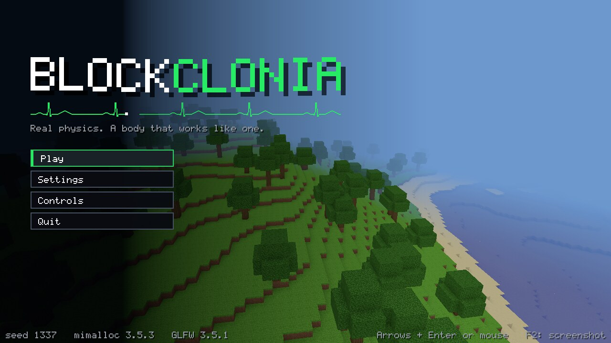
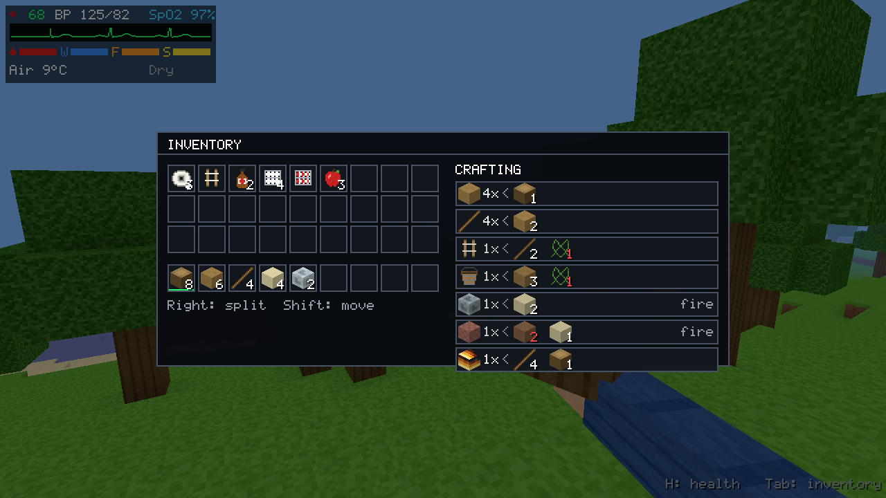
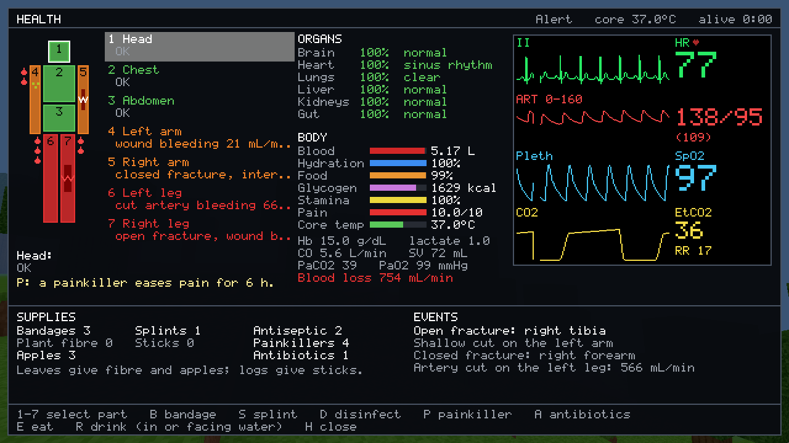
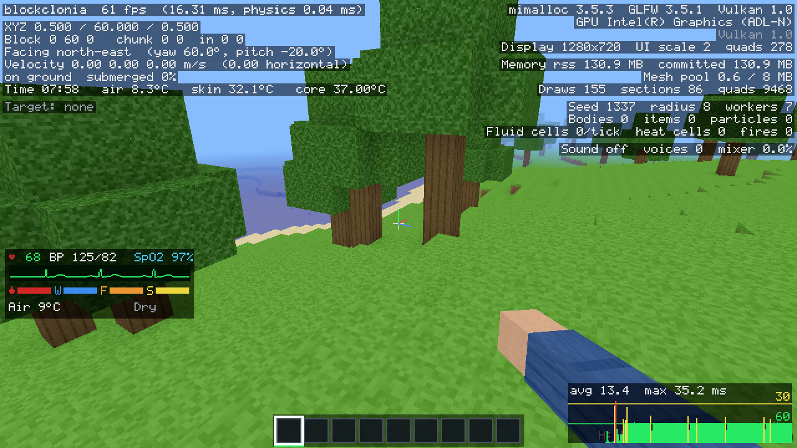

# blockclonia

A Minecraft-style voxel sandbox written from scratch in C11 and Vulkan,
with physics that tries to behave like the real world, a simulated human
body instead of a health bar, and a renderer tuned for low-end hardware.
Every texture and sound is generated at start-up, and all memory comes from
[mimalloc](https://github.com/microsoft/mimalloc).



## What's in it

- **Infinite terrain** streamed around the player in 16×128×16 columns:
  continents, hills, ridged mountains with snow, beaches, oceans and trees.
- **Realistic physics** (1 block = 1 m, SI units, fixed 60 Hz step). See
  [Physics](#physics).
- **Heat and weather**: a day that lasts 20 minutes, air temperature from
  altitude, time of day and shelter, campfires that burn fuel and heat
  their surroundings, and snow and ice that melt while still water freezes.
  See [Heat](#heat).
- **A body that works like one** (press **H**): circulation, breathing,
  metabolism, temperature and a long list of injuries, all treatable. See
  [Health](#health).
- **Inventory and crafting** (press **Tab**): 36 slots, a hotbar, stacks
  you can split and move, and recipes, some of which need a campfire. Items
  you drop are physical objects that bob, spin and roll to you when you
  walk past.
- **Menus** in the same style as the HUD: a title screen, a pause menu, a
  settings screen with Video, Controls and Audio tabs, and a controls
  reference.
- **F3 debug overlay**: position, facing, the targeted block's material
  properties and temperature, frame-time graph, memory, renderer and GPU,
  physics and sound statistics.
- **Procedural sound**: footsteps, impacts and breaking per material,
  splashes, fire, wind and water ambience, all synthesized at start-up and
  mixed in 3D.
- **Animation throughout**: head bob, a landing dip, a wider view while
  sprinting, a first-person arm that sways, swings, eats and switches
  items, tumbling falling blocks, debris and splashes, and menus and HUD
  alerts that slide and fade.
- **Saves**: only the columns you changed are written, one RLE-compressed
  file per column, atomically, plus your position, inventory and the time
  of day. Autosave runs every minute.

## Controls

| Key | Action |
|---|---|
| Mouse | Look (click the window to capture the cursor) |
| W A S D | Walk |
| Left Ctrl, or double-tap W | Sprint (hold, or toggle in Settings → Controls) |
| Left Shift | Sneak: slower, and you won't walk off edges (in fly mode: down) |
| Space | Jump / swim up (in fly mode: up) |
| F | Toggle fly mode (no injuries while flying) |
| Left click (hold) | Break the block; takes the material's hardness in seconds |
| Right click | Place the held block, use the held item (fill or empty a bucket, eat an apple, feed a campfire, put a defibrillator's pads on or take them off) |
| Middle click | Pick the targeted block into the hand |
| 1–9 or scroll | Select a hotbar slot |
| Q / Ctrl+Q | Drop one item / the whole stack |
| Tab or I | Inventory and crafting |
| H | Health panel |
| E / R | Eat an apple / drink (standing in or facing water, or holding a water bucket) |
| F2 | Screenshot (`screenshot.ppm`) |
| F3 | Debug overlay |
| K (with F3 on) | Debug health menu: trigger any injury, or heal |
| Esc | Close the inventory or panel; otherwise pause |
| Enter | Respawn after death |

**Inventory screen**: left click takes, places, merges or swaps a stack;
right click takes half a stack or places one item; Shift+click moves a
stack between the hotbar and the backpack; click outside the panel to
drop what you are holding.

**Health panel**: 1–7 or ↑/↓ pick a body part, then B bandage, S splint,
D disinfect, P painkiller, A antibiotics, C cool a burn, X reduce a
dislocation.

**Menus**: mouse, or arrows and Enter; ←/→ change a setting; Esc goes back.



## Physics

- **Gravity and drag**: 9.81 m/s², quadratic air drag (terminal velocity
  ≈ 49 m/s for the player), buoyancy from real densities (a human barely
  floats, a log floats, stone sinks) and water drag.
- **Walking is limited by friction**: you can only accelerate or brake at
  μ·g, so ice (μ = 0.03) is genuinely slippery and stopping on grass takes
  about a metre. Sprinting and sneaking change the target speed, not the
  physics.
- **Materials**: every block has a density, friction, restitution,
  hardness, cantilever span, heat capacity and thermal conductivity. F3
  shows them for the block you look at.
- **Structural integrity**: every block needs a load path to the ground.
  Each material can cantilever a set number of blocks (stone 7, timber 6,
  brick 5, dirt 1); sand and gravel only rest on what's directly below.
  Knock out a support and everything it held becomes falling rigid bodies.
  They tumble as they fall, bounce by their restitution, slide to a stop
  by friction, shatter if they are glass or ice, shove or pin the player,
  and re-solidify where they land. Cut a tree's trunk and the tree comes
  down.
- **Water** is a volume-conserving cellular automaton with 8 levels per
  block: it falls, spreads, levels out and never duplicates itself.
  Placing a block into water pushes the water aside instead of deleting
  it.


## Heat

- **The day** runs on the survival clock (72× real time), so a day lasts
  20 minutes. Daylight and the sky colour follow the sun.
- **Air temperature** falls with altitude, putting 0 °C at the snow line,
  swings between day and night, and stays near the ground's mean in
  enclosed spaces.
- **Blocks conduct heat** by their conductivity and heat capacity, and air
  carries it upward by convection. Only cells that differ from the
  surrounding air are simulated.
- **Campfires** (crafted from sticks and a log) burn their fuel, which you
  top up by using a log or sticks on them, heat the air around them,
  radiate onto your skin with a Stefan–Boltzmann falloff, and turn to ash
  when the fuel runs out. They enable the glass and brick recipes.
- **Phase changes with latent heat**: snow and ice near heat melt into
  water (snow gives less), and still surface water freezes in freezing
  air.
- **The body feels all of it**: air temperature, radiant heat, and the
  ground under your feet, through clothing that stops insulating when it
  gets wet.

## Health



The player is a 75 kg adult simulated in real time: a circulation model
(blood volume, heart rate, stroke volume, vascular resistance, a
baroreflex), breathing driven by CO₂ and O₂, an oxygen store with a real
dissociation curve, core and skin temperature, water and energy balance,
and stamina as an anaerobic reserve. Slow processes (infection, healing,
thirst, hunger) run on the survival clock.

- **The HUD** shows heart rate, blood pressure and SpO₂ with a live ECG
  strip, bars for blood, water, food and stamina, the air temperature and
  whether you are wet, and alerts that slide in and fade out. Failing
  brain oxygen narrows vision; fainting blacks the screen out.
- **The H panel** has a body diagram and the status of each of the seven
  parts, advice for the selected one, the organs (brain, heart, lungs,
  liver, kidneys, gut), needs, lab-style numbers (Hb, lactate, cardiac
  output, blood gases), and a bedside monitor with ECG, arterial pressure,
  pleth and capnography traces.
- **Injuries come from the physics**: landings (softened by leaves, snow
  or sand), running into walls, sliding on rough ground, falling blocks by
  mass and speed, blocks pinning you down, smashing glass by hand, fire and
  cold. The body can suffer bruises, sprains, closed and open fractures,
  dislocated shoulders and elbows, venous and arterial cuts, abrasions,
  internal bleeding, concussion and bleeding inside the skull,
  pneumothorax, crush injury and crush syndrome, burns, frostbite,
  infection and sepsis.
- **Treatment uses supplies** from a starting kit and from the world:
  leaves give plant fibre and apples, planks give sticks, two fibres make
  an improvised bandage, and two sticks and a fibre make a splint. A
  defibrillator in the kit is put on with a right click; once its pads are
  on the chest it runs like a fully automatic AED, analysing the rhythm
  and shocking ventricular fibrillation by itself, less likely to bring a
  heartbeat back the longer the heart has been fibrillating.
- **Vitals respond to what you do**: sprinting raises heart rate, pressure
  and breathing and spends stamina; bleeding drops pressure while the
  heart races; holding your breath under water slows the heart (the diving
  reflex) until you black out and inhale water.

You can die of blood loss, drowning, suffocation, head injury, cardiac
arrest, sepsis, dehydration, starvation, hypothermia, heatstroke, trauma
or burns.

## Crafting

| Makes | From | Needs |
|---|---|---|
| 4 planks | 1 log | |
| 4 sticks | 2 planks | |
| 1 splint | 2 sticks, 1 plant fibre | |
| 1 bucket | 3 planks, 1 plant fibre | |
| 1 campfire | 4 sticks, 1 log | |
| 1 glass | 2 sand | a burning campfire nearby |
| 1 brick | 2 dirt, 1 sand | a burning campfire nearby |

## Settings

Settings are saved in `blockclonia.cfg` under the config directory (or
the file given with `--config`) as one `key value` pair per line. See
"Where files live" below for the exact path. Unknown keys and
out-of-range values are ignored.

| Tab | Setting | Range |
|---|---|---|
| Video | Field of view | 50–110° (default 70) |
| Video | GUI scale | automatic, or 1–4 |
| Video | VSync | on/off |
| Video | Render distance | 2–32 columns; applies on the next start |
| Video | Texture filtering (distance) | on/off |
| Video | View bobbing, FOV effects | on/off |
| Controls | Mouse sensitivity | 10–300% |
| Controls | Invert Y, sprint toggle, key hints | on/off |
| Audio | Master, effects, ambience volume | 0–100% |

## Sound

There are no audio files. At start-up (in about 50 ms) the game
synthesizes every effect from noise, filters, resonant modes and
envelopes, shaped per material: stone knocks, wood thuds, glass rings,
sand hisses, water splashes. Wind, running water and fire are seamless
loops. A software mixer plays up to 48 voices with distance attenuation,
stereo panning, and a low-pass filter that muffles everything under water.
It runs on the audio thread with no locks or allocation, and the game
talks to it through a lock-free queue. Output goes through
[miniaudio](https://miniaud.io), which picks PipeWire, PulseAudio, ALSA,
WASAPI or CoreAudio at run time. `--no-sound` skips the audio device
entirely.

## Built for low-end devices

| Technique | Why it matters on weak hardware |
|---|---|
| 4-byte vertices (position, face, AO, texture layer packed in one `uint32`) | 4–8× less vertex bandwidth than a naive float layout |
| Greedy meshing with baked ambient occlusion | Far fewer triangles; AO costs nothing at runtime |
| A few large vertex pool buffers for every chunk mesh, one shared index buffer | Few binds per frame; never hits `maxMemoryAllocationCount` |
| Integrated GPUs write meshes straight into shared memory | No staging copy on UMA devices |
| Face groups facing away from the camera skipped per section | About half the terrain triangles never reach the GPU |
| Every entity is one instanced cube draw | Items, particles and falling blocks cost one draw per pass |
| Push constants instead of uniform buffers | No descriptor updates per frame |
| Reversed-Z projection with a float depth buffer | Stable depth at any distance |
| No `discard` in any shader, depth attachment never stored | Keeps early-Z and on-chip depth on tile-based mobile GPUs |
| Camera-relative rendering, doubles for physics positions | No jitter far from spawn |
| CPU frustum culling per 16³ section, front-to-back opaque, back-to-front translucent | Less overdraw |
| Meshing and generation on worker threads from private snapshots | Main thread never waits, edits never race |
| Procedural textures with mipmaps and procedural sound, generated at startup | No asset files to ship or parse |
| Vulkan 1.0 core with zero required optional features | Runs on anything with a Vulkan driver, including Raspberry Pi (V3DV) |



## Building

Dependencies: a C11 compiler, CMake ≥ 3.21, Ninja, the Vulkan headers and
loader, `glslc` (shaderc), GLFW 3.5, mimalloc 3.5 and miniaudio 0.11. The
build fetches GLFW 3.5.1, mimalloc 3.5.3 and miniaudio 0.11.25 when the
system copies are missing or older. `-DMC_DEPS=SYSTEM` still accepts GLFW
3.3+ and mimalloc 2.1+ for distro packaging, and builds a silent game if
miniaudio isn't installed.

Debian, Ubuntu, Raspberry Pi OS:

```sh
sudo apt install build-essential cmake ninja-build glslc libvulkan-dev \
                 libglfw3-dev libmimalloc-dev mesa-vulkan-drivers
cmake --preset native            # tuned for this machine (use this on a Pi)
cmake --build --preset native
./build/native/blockclonia
```

- If the distro's mimalloc or GLFW is older than 3.5 (most distros today),
  the default `MC_DEPS=AUTO` downloads and compiles the pinned releases.
  Building GLFW needs the X11 and Wayland headers and `wayland-scanner`
  (`libx11-dev libxrandr-dev libxinerama-dev libxcursor-dev libxi-dev
  libwayland-dev libwayland-bin libxkbcommon-dev`). `-DMC_DEPS=SYSTEM` forbids downloads; `FETCH` always
  uses the pinned releases. For a reproducible build, set
  `MC_MIMALLOC_SHA256`, `MC_GLFW_SHA256` and `MC_MINIAUDIO_SHA256` (see
  [SECURITY.md](SECURITY.md#supply-chain)).
- `-DMC_SOUND=OFF` builds without sound (no miniaudio needed).
- `cmake --list-presets` shows the rest: `dev`, `release` (-O2 + LTO,
  portable), `profile`, `asan`, `core` (no Vulkan or GLFW needed), `fuzz`,
  `ci-gcc`/`ci-clang` (-Werror), and cross builds for the Pi 4/5
  (`pi4-aarch64`, `pi5-aarch64`, `pi4-armhf`; see the header of
  `cmake/toolchains/rpi-aarch64.cmake`).
- `-DMC_CPU=pi4|pi5|native|x86-64-v2` picks the CPU to tune for. 32-bit
  Pi OS's compiler has NEON off by default, so set it there.
- Packages: `cd build/release && cpack` makes a `.tar.gz` and a `.deb`.

### Running

```
blockclonia [--seed N] [--radius 2-32] [--size WxH] [--no-vsync]
            [--threads N] [--pool-mb N] [--gpu N] [--world DIR | --no-save]
            [--config FILE] [--validate] [--no-sound]
            [--play] [--screen title|pause|settings|controls|debug-health|inventory]
            [--debug] [--time HH] [--give LIST] [--hurt LIST]
            [--frames N] [--screenshot F] [--look YAW,PITCH] [--spawn X,Z]
            [--demo] [--health-panel] [--bench] [--mem-stats]
```

- `--play` skips the title screen; `--screen` opens a menu at start and
  `--debug` turns F3 on.
- `--give log:8,sand:4` starts you with items (names as shown in game).
  `--time 21` starts at 21:00.
- `--hurt` starts you injured, to try treatments or take screenshots: a
  comma list of names (`--help` lists them all: bleeds, fractures, burns
  of each degree, frostbite, dislocation, crush, infection, hypothermia,
  hyperthermia, pain, shock, sepsis and cardiac arrest, plus `pads` to
  start with a defibrillator's pads on). The injury names, as buttons, are
  what the debug health menu (F3, then K) picks from, to trigger any of
  them on a live body and to heal.
- For very weak devices start with `--radius 4`. `--demo` builds a tower
  with a timber cantilever in front of you and knocks out its middle.
  `--bench` runs CPU benchmarks without opening a window.
- `--world` and `--config` default to the XDG paths described in "Where
  files live" below, instead of a fixed name in the working directory.
- `blockclonia --help` lists everything.

Headless (no GPU), with Mesa's software rasterizer:

```sh
xvfb-run -a env VK_ICD_FILENAMES=/usr/share/vulkan/icd.d/lvp_icd.x86_64.json \
  ./build/native/blockclonia --frames 300 --screenshot shot.ppm --no-save --no-sound
```

## Where files live

blockclonia follows the XDG Base Directory Specification:

- Settings: `$XDG_CONFIG_HOME/blockclonia/blockclonia.cfg`, falling back
  to `~/.config/blockclonia/blockclonia.cfg`.
- Worlds: `$XDG_DATA_HOME/blockclonia/worlds/world/`, falling back to
  `~/.local/share/blockclonia/worlds/world/`.
- The Vulkan pipeline cache:
  `$XDG_CACHE_HOME/blockclonia/blockclonia.pipelines`, falling back to
  `~/.cache/blockclonia/blockclonia.pipelines`.

An `XDG_*` variable is ignored when it is empty or not an absolute path,
as the spec requires; the game then falls back to the `$HOME`-based path
above. `--world` and `--config` still take any path directly.

The first time the game finds a settings file or world where older
builds kept them (`./blockclonia.cfg`, `./world`), it copies them into
the new location once and keeps using it from there on; the originals
are left in place, so an older build run from the same directory still
finds its own copy.

## Memory allocation

Game code allocates through `src/mem.h`, which wraps mimalloc's `mi_*` API
and aborts cleanly on out-of-memory. mimalloc is linked first, so on Linux
its shared library also overrides `malloc` for GLFW, the Vulkan loader, the
GPU driver and miniaudio (`LD_DEBUG=bindings` confirms they bind to
`libmimalloc.so`). Explicit `VkAllocationCallbacks` backed by mimalloc are
available with `MC_VK_ALLOC=1` for platforms without the override. They
are off by default because some drivers (Mesa lavapipe) free memory they
did not allocate through the callbacks.

## Tests

```sh
cmake --preset dev && cmake --build --preset dev && ctest --preset dev
tools/lint.sh      # -Werror builds (gcc, clang), clang-tidy, cppcheck, shaders, clang-format
```

`ctest` runs the unit tests, `--bench`, and, when `xvfb-run` and Mesa's
lavapipe are installed, a 120-frame render with the validation layer.

The unit tests (about 2400 checks, no window or GPU needed) cover:

- **engine**: the vertex-pool allocator, save round-trips and corruption
  rejection, the settings file, the mesher (greedy merging, worst case,
  water), world edits and mesh invalidation, and the Vulkan feature
  selection (`gpucaps`);
- **physics**: free fall against √(2h/g), no tunnelling at 60 m/s, wall
  collision, jump height, friction on ice and stone, sprinting and
  sneaking, cantilever limits, tree felling, sand, buoyancy, water volume
  conservation, bodies that bounce, slide, tumble, shatter, splash, shove
  and pin the player, dropped items and raycasting;
- **heat**: the sun and air temperature, fires heating the air and
  radiating, fuel, melting and freezing;
- **health**: resting and exercising vitals, arterial bleeding with and
  without a dressing, breath-holding and drowning, fractures and splints,
  dislocations, abrasions, crush injuries, burns and cooling them, cold
  and wet clothing, infection, thirst and hunger, defibrillation of
  ventricular fibrillation and landings through the player physics;
- **interface and sound**: the UI batch (text metrics, wrapping,
  overflow), the menus, the inventory and crafting, the HUD, the view
  model's animations, the camera, the synthesized sound bank and the
  mixer (distance, panning, underwater, more sounds than voices, loops).

## Documentation

- [docs/ARCHITECTURE.md](docs/ARCHITECTURE.md): the frame loop, the
  threads, and how the modules fit together.
- [AGENTS.md](AGENTS.md): the rules for changing the code (for people and
  AI coding agents). [CONTRIBUTING.md](CONTRIBUTING.md) covers issues and
  pull requests.
- [SECURITY.md](SECURITY.md): what counts as a vulnerability and how to
  report one.
- Each header in `src/` starts with a description of its module.

## Layout

```
src/main.c        entry point, input, the frame loop and glue
src/renderer.c    Vulkan renderer      src/gpucaps.c   which Vulkan features to use
src/world.c       column streaming, block access, job scheduling
src/worldgen.c    terrain generation   src/noise.c     gradient noise
src/mesher.c      greedy mesher with AO
src/texgen.c      procedural textures  src/block.c     block materials
src/physics.c     player, bodies, items, structure, water, raycast
src/thermo.c      day clock, air temperature, heat field, fire, melting
src/health.c      the body: circulation, breathing, injuries, treatment
src/survival.c    turns physics and heat into injuries, limits movement
src/interact.c    breaking, placing, buckets, dropping
src/inventory.c   slots, stacks, crafting      src/item.c   items and drops
src/sound.c       mixer and voices     src/sound_synth.c   the synthesized bank
src/audio_device.c  miniaudio output   (audio_null.c for silent builds)
src/menu.c        title, pause, settings, controls screens
src/hud.c         HUD, H panel, monitor            src/invui.c   hotbar and inventory screen
src/debug.c       F3 overlay           src/ui.c        2D overlay batch and font
src/camera.c      camera motion        src/viewmodel.c the first-person arm
src/fx.c          debris, splashes and the entity list      src/anim.h   easing helpers
src/settings.c    the settings file    src/save.c      world files
src/jobs.c        thread pool          src/gpupool.c   vertex pool allocator
src/mem.c         mimalloc wrappers    src/log.c       logging, save-on-fatal hook
src/bench.c       --bench
shaders/          GLSL, compiled to SPIR-V and embedded at build time
tests/            unit tests and the save-file fuzzer
cmake/            dependencies, shaders, warnings, packaging, Pi toolchains
tools/lint.sh     the lint gate CI runs
```
